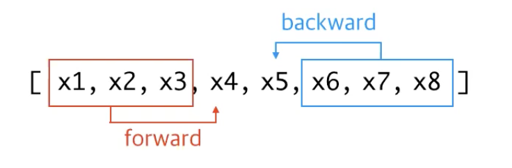

# XLNet : Generalized Autoregressive Pretraining for Language Understanding

- [oringinal paper (PDF)](source/XLNet.pdf)
    

## Keywords

`autoencoding (AE)`; `autoregressive (AR)`; `BERT`; `permutation`; `XLNet`; `mask`; `token`; `corrupted sentance`; `restore`; `context representation`; `factorization`; `sequence`; `segment`

## Abstract

- `autoencoding` 방식의 BERT 는 masked 된 토큰들 간의 관계를 고려하지 않는다.
    
    
    
         masking 되지 않은 토큰들(초록 상자)을 통해 masked 토큰을 추론한다. 
    
- 한계를 극복하고자 `autoregressive` 방식을 채택하고, 모든 토큰에 대하여 `permutation` 하여 이를 극복하는 `XLNet` 을 소개한다.
- XLNet 은 선행 연구 Transformer-XL 을 계승하는 모델이다.
- 여러 분야에서 SOTA 를 달성하고, 20개의 task 에서 BERT 를 능가한다.

## Introduction

- pretrain 에 다양한 `objective` 를 적용하여 downstream task 에 finetune 방식
    - **Language modeling (GPT)** `autoregressive`
    - **Prefix language modeling**
    - **Masked language modeling (BERT)** `autoencoding`
- `AR objective` language model
    
    
    
    - density estimation 활용
        - ext corpus 통해 histogram의 probability distribution 을 추정하는 방식으로 unsupervised model 에 적합 (하단 링크 참조)
            
            [https://blog.mathpresso.com/mathpresso-머신-러닝-스터디-14-밀도-추정-density-estimation-38fd7ef729bb](https://blog.mathpresso.com/mathpresso-%EB%A8%B8%EC%8B%A0-%EB%9F%AC%EB%8B%9D-%EC%8A%A4%ED%84%B0%EB%94%94-14-%EB%B0%80%EB%8F%84-%EC%B6%94%EC%A0%95-density-estimation-38fd7ef729bb)
            
    - 왼쪽→오른쪽(오른쪽→왼쪽)의 uni-directional 으로 다음에 올 단어를 예측하는 모델
    - 새로운 글을 생성하는 task 에 대해서는 매우 효과적
    - uni-directional 한 특성으로 글의 문맥을 파악하는(requiring bi-directional) task에 대해서 성능이 떨어진다.
    
- `AE objective` based pretraining
    
    
    
    - density estimation 이 아닌 corrupted input(ie. masked tokens) 을 원문장 복구를 목표
        - 따라서 bi-directional
    - corrupted input 구조는 특정 확률로 가려진 토큰들의 관계를 무시
    
    <aside>
    ❓ Since density estimation is not part of the objective, BERT is allowed to utilize bidirectional  contexts for reconstruction.
    
    </aside>
    
    - 👉👉👉👉👉👉👇
        
        <aside>
        ☝ 밀도 추정(확률 분포) 를 objective로 사용하지 않음 → bidirectional 하게 문장 복구 가능
        
        </aside>
        
        <aside>
        ☝ uni/bi - directional 과 밀도 추정 사이에 관계??
        
        </aside>
        
        <aside>
        ☝ unidirectional 경우, 시퀀스 상의 누적된 정보를 통해 확률 분포(히스토그램) 추정 가능?
        
        </aside>
        
        <aside>
        ☝ bidirectional 경우, 시퀀스 상에서 무작위로 mask 된 부분(X) 에서 구멍 생기므로 추정 불가??
        
        </aside>
        
    - finetuning(real : downstream tasks) 에서는 mask 등장하지 않으므로 pretrain 과의 괴리 발생
    - `AR` 방식처럼 결합 분포에서 product rule 을 적용하지 못한다. (❓ 에 대한 답)
    
    
    
        A가 masked token 이라고 한다면 위는 단순히 ∏p(A_i) 가 될 것이다!
    
    - $\mathcal{J}_{BERT}=\log p(New\,|\,is\;a\;city) +\log p(York\,|\,is\;a\;city)$ mask1 의 유무에 따라 다른 mask2 의 토큰 결정에 확률적인 반영이 되어야 하지만, 단순 곱계산을 통해 독립적으로 취급된다.
    - 글이 길어지는 상황 [high-level : 넓은 범위의 유기적 관계가 중요해지는] 을 지나치게 단순화
    
- ***위의 장단점으로 `AE` 방식의 단점은 죽이고 장점을 최대한 살리는 방식으로서 `AR` 방식 `XLNet` 제시!!***
    - `AE +` : 시퀀스 상의 token 들을 섞는다 (`permutation`)
        - 단방향의 `AR` 방식에서 양방향 효과를 낼 수 있도록
        - 텍스트의 방향성을 없에는 작업 (글은 왼→오른 쪽으로 읽으니깐)
    - `AE -` : 사라지는 토큰(masked token)이 없음
        - pretrain-finetune 괴리 사라짐
    
- ***참신한 `AR` objective 방식의 또다른 이점***
    - Transformer-XL 방식의 reccurence mechanism 과 relative encoding scheme 을 차용
        
        
        
        - 시퀀스 단위의 학습은 long term context (real tasks 에서 요구되는) 에 대해 성능이 떨어지므로 더 큰 단위의 segment 로 나누어 caching을 진행하고 다음 segment 에 유기적으로 학습이 전달되도록
        

## Proposed Method

**Background**

- 주어진 텍스트 시퀀스 $\mathtt{x}=[x_1, \cdots , x_n]$ 에 대하여 `AR` 방식과  `BERT` 를 비교한다.
    - 다음과 같은 방식으로 forward AR factorization 학습 효율을 증대
        - $h_\theta (x_{1\,:\,t-1})$ 은 은닉층의 context representation, $e(x)$ 는 $x$ 의 embedding .
    
    
    
    - BERT 는 다음과 같이
        - AR 과 다르게 context 자체가 아닌 문장 복구에 관심있으므로
        - $\mathtt{x},\hat{x},\bar{x}$ 각각 입력 시퀀스, 붕괴된 $x$(masked), $\hat{x}$ 의 masked token
        - $m_t=1\,or\,0,\,T,H_\theta(x)=[H_\theta(x)_1,H_\theta(x)_2,\cdots,H_\theta(x)_T]$ 각각 $x_t$의 masked 여부, 시퀀스 $x$ 의 길이, $x$ 를 매핑해주는 transformer
        
        
        

- 위의 두 방식의 장단점
    - independance assumption :
        - BERT  : 결합확률을 masked token 간에 독립이라고 가정
        - AR : 결합확률을 chain rule 을 적용하여 추정 (bayesian chain rule)
    - input noise
        - BERT : real task 에서는 등장하지 않는 pretrain 상의 mask
        - AR : 완전한 문장
    - context dependency
        - BERT : $p_\theta(x_t|\bar{x})$ 로 bidirectional
        - AR : $p_\theta(x_t|x_{<t})$$p_\theta(x_t|\bar{x})$  로 unidirectional

**Objective : Permutation Language Modeling (Permutation AR)**

- 길이 T 의 입력 시퀀스 $\mathtt{x}=[x_1,\cdots,x_T]$ $x$는 토큰
    - permutation 진행하므로 T! 가지의 서로 다른 시퀀스 발생
    - 모델은 양방향으로 토큰의 위치에 대한 학습을 더 효과적으로
- 발생한 시퀀스에 대한 set $Z_T$ 와 가능한 모든 길이 T $(1,2,\cdots,T)$
    - $z_t,\mathtt{z}_{t<}$ 각각 $Z_T$ 의 t번째 원소 시퀀스,  앞의 t-1 토큰들에 대한 permutation 시퀀스
    - $x_t$ 무작위 토큰 (단 $x_i \neq x_t$ )
    - 아래 식을 통해 bidirectional 효과를 얻는다.
    
    
    

**Architecture : Two-Stream Self-Attention for Target-Aware Representations**

- language modeling objective(다음 토큰을 추론) 특성
    - 순수한 기능으로의 Transformer parameterization 사용할 수 없음
        - Softmax 로 paremeter … 어쩌구 저쩌구..
        - 식을 보면, $h_\theta(\mathtt{x}_{\mathtt{z}_{<t}})$ ($\mathtt{z}_{<t}$: 앞의 t-1 토큰에 대한 permutation 시퀀스 집합 / $\mathtt{x}_{\mathtt{z}{<t}}$ :  t-1 토큰 들의 집합 /  각각 위치 정보는 고정) 가 $z_t$( $\mathtt{z}_{<t}$의 원소 시퀀스(위치 정보)) 와 관련이 없다.
            
            
            
                $z_t$ 에 대한 항을 눈을 씼고!! 찾아봐도 찾을 수 없다ㅠ🔥
    
               

       
        > **Note 🔥**
        >
        > 즉 $z_t$ 가 아닌 $[z_t,z_{t+1},\cdots,z_{t+k},\cdots,z_{T}]$ 의 아무 z 에 대한 추론일 수도 있다는 것!!
        

- 이러한 애매함을 해결하기 위해 ‘stand target position’
    - $h_\theta$ 를 $g_\theta$ 로 대체 $g_\theta(\mathtt{x}_{\mathtt{z}_{<t}},z_t)$
        - 원소 시퀀스 $z_t$ 에 초점이 맞춰져 있어서 attention 통해 $\mathtt{x}_{\mathtt{z}_{<t}}$에 대한 문맥 추론 획득
        - 그러나 문제!
            - $x_{z_t},g_\theta(\mathtt{x}_{\mathtt{z}_{<t}},z_t)$ 토큰을 추론하기 위해선 $z_t$ 만 사용해야 하고, $x_{z_t}$는 사용하면 안됌!
                - 추론하고자 하는 값이 이미 주어지면 의미가 없음 (너무나 trivial(자명)해서)
            - $x_{z_j}$ 를 추론하기 위해 $j>t,g_\theta(\mathtt{x}_{\mathtt{z}_{<t}},z_t)$ 에서도 $x_t$ 가 참조된다.
            
- 또 이걸 동시에 해결하는 ‘two-stream’
    - content representation  : $h_\theta(\mathtt{x}_{\mathtt{z}_{\leq t}},z_t)\;\;or\;\;h_{z_t}$
        - Transformer 의 은닉 representation 과 비슷, 문맥($\mathtt{x}_{\mathtt{z}_{<t}}$) 과 $x_{z_t}$ 모두 인코딩
    - query representation : $g_\theta(\mathtt{x}_{\mathtt{z}_{< t}},z_t)\;\;or\;\;g_{z_t}$
        - 문맥($\mathtt{x}_{\mathtt{z}_{<t}}$) 과 위치($z_t$) 만 추론
        - $x_{z_t}$의 내용 자체는 x 참조

     Q,K,V 를 각각 따로 분리해서 두개의 흐름(two-stream) architecture 구현

- partial prediction
    - 우수한 점들이 많지만
        - permutation 따른 최적화 문제
        - 점근 속도(slow convergence) (학습속도가 느리다는 건가?)
    - 이를 해결하기 위해
        - 무작위 배열 시퀀스의 마지막 토큰만 추론 (the first→ the last $T)$
            - c 를 도입하여 (non-target,target) ($\mathtt{z}_{\leq c},\mathtt{z}_{>c})$ 으로 슬라이스
                
                
                
                                              넓은 문맥을 파악하는 데 있어 z>c 가 더 효과적이니깐 target
                
            
            
            

**Incorporating Ideas from Transformer-XL**

- XL-Transformer 의 relative positional encoding & segment recurrence
    - $\tilde{\mathtt{x}}=\mathtt{s}_{1:T},\mathtt{x}=\mathtt{s}_{T+1:2T}$.    $[1,\cdots,T],[T+1,\cdots,2T]$
    - ~ 항들($h_{z_t}^{(m-1)}$의 representation)에 의해 caching(update) 이 지속적으로 이뤄지므로 더 유기적인 architecture → long term context 에 더 효과적으로
    
    
    
        KV에 두개 항이 들어가는 것을 확인!
    
    
    

**Modeling Multiple Segments**

- 이제 위의 것들을 이용해서 어떻게 pretrain 할 것이냐
    - 무작위 segment 두개를 골라 concat 후 하나의 sequence로 취급 → permuation
    - 같은 context 상의 memory 만 사용 (위에서 언급한 caching 과 관련한 메모리)
    - BERT 의 [CLS, A, SEP, B, SEP] 을 그대로 input에 사용
        - CLS : sequence 시작, A : 첫번째 segment, SEP : 문장 끝, B : 두번째 segment 시작
        - (XLNet -Large 경우 NSP(Next Sentence Prediction)는 하지 않는다.